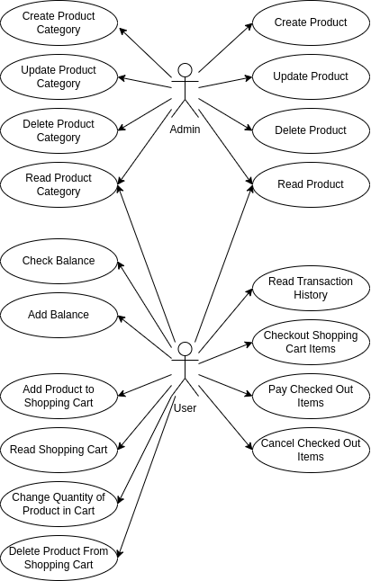
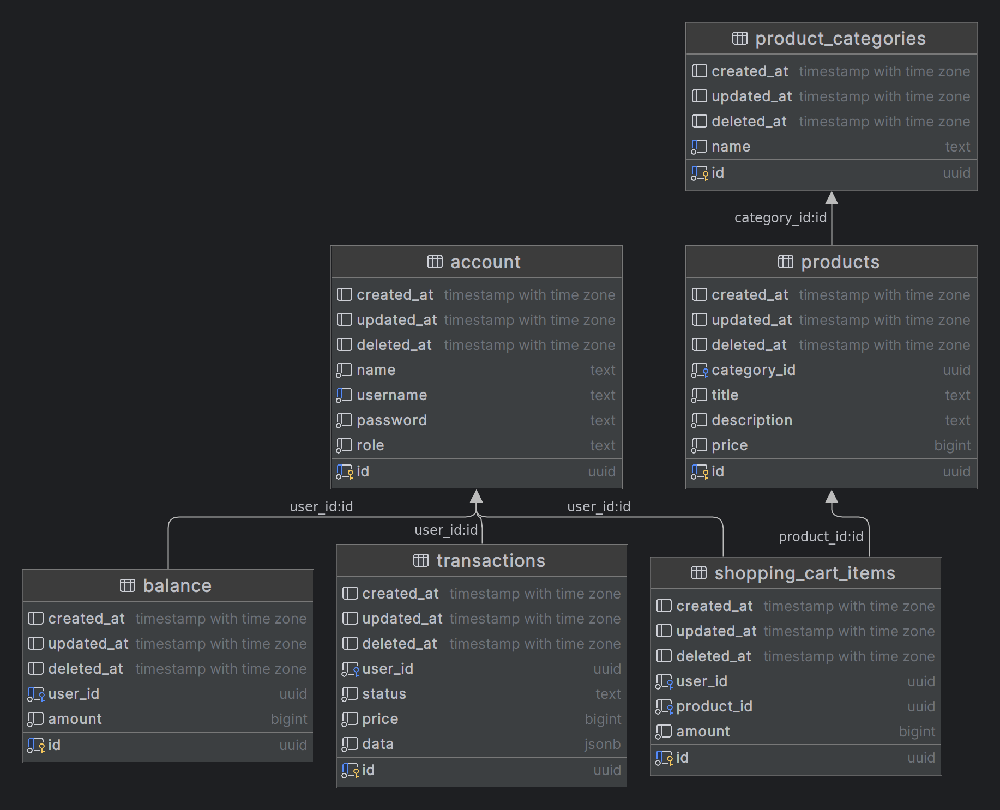

<h1 align="center">
  Online Store Application Backend Repository
</h1>

<p align="center">Backend documentation</p><br>

## ⭐ System Design

### RESTful API Documentation

https://documenter.getpostman.com/view/23485427/2s9Y5YShoD

### Usecase Diagram



### Entity Relationship Diagram (ERD)



### Deployment

https://online-store.hilmy.dev


## ⚡️ Development Setup

### Prerequisites

- [Download](https://go.dev/) and install **Go** version `1.21.0` or higher.
- [Download](https://www.postgresql.org/download/) and install **PostgreSQL** database version `15` or higher. You can also use containerized PostgreSQL (eg using Docker) to make the installation process easier.
- [Download](https://www.mongodb.com/try/download/community) and install **MongoDB** database version `7` or higher. You can also use containerized MongoDB (eg using Docker) to make the installation process easier.
- Clone this project and open it using your favorite code editor.

### Setting Up Project

- Create an `.env` file containing the appropriate configuration. You can look at the [.env.example](https://github.com/mnaufalhilmym/online-store/blob/main/.env.example) file as an example.

- Get any missing modules and remove unused modules:

  ```bash
  go mod tidy
  ```

- Run the project:

  ```bash
  go run ./src/
  ```

- To build this project, run the command below. Make sure you have changed `APP_MODE` in .env file to `RELEASE`.

  ```bash
  go build ./src/
  ```

## ⚙️ Project Structure

### Directory Tree

```
.
└── store/
    ├── src/
    │   ├── constants/
    │   ├── contracts/
    │   ├── libs/
    │   ├── modules/
    │   │   ├── moduleName0/
    │   │   │   ├── module0Contract.go
    │   │   │   ├── module0Controller.go
    │   │   │   ├── module0Entity.go
    │   │   │   ├── module0Module.go
    │   │   │   └── module0Service.go
    │   │   └── moduleName1/
    │   │       ├── module1Contract.go
    │   │       ├── module1Controller.go
    │   │       ├── module1Entity.go
    │   │       ├── module1Module.go
    │   │       └── module1Service.go
    │   ├── app_controller.go
    │   ├── app_module.go
    │   └── main.go
    ├── .env
    ├── compose.yaml
    ├── Dockerfile
    ├── go.mod
    └── go.sum
```

### Explanation

1. .env

   A dotenv file is a simple text configuration file for controlling applications environment constants.

1. compose.yaml

   compose.yaml file is a configuration file used in Docker Compose, a tool that simplifies the management of multi-container Docker applications. This YAML file allows you to define and configure the various services, networks, volumes, and other settings needed to run your application.

1. Dockerfile

   A Dockerfile is a text-based script used to create Docker images. Docker images are the blueprint or template for Docker containers, which are isolated and portable environments that can run applications and their dependencies consistently across different systems.

1. main.go

   This file contains the server initialization. It creates a [fiber](https://docs.gofiber.io/) instance, loads some middlewares, and calls a function to load the server modules.

1. app_module.go

   This file loads the server modules.

1. app_controller.go

   This file is for defining root controller or '/' endpoint.

1. modules/

   This folder contains server modules. Each module is a folder that can contain its own contract, controller, entity, module, and service files. The module file is for defining the function to instantiate the module and load it.


## 📖 Contributing Guidelines

Before contributing, consider the following guidelines:

- [Fork](https://docs.github.com/en/github/getting-started-with-github/fork-a-repo) this repo.

- In your forked repository, make your changes in a new git branch:

  ```shell
  git checkout -b fix/my-fix-branch main
  ```

- Create your patch.

- To ensure consistency throughout the source code, please follow rules in the [Effective Go](https://go.dev/doc/effective_go) and pay attention to the [project structure](#⚙️-project-structure).

- Test your changes.

- Commit your changes using a descriptive commit message that follows [Conventional Commits](https://www.conventionalcommits.org). You can use [Commitizen](https://commitizen-tools.github.io/commitizen/) to make writing commit messages easier.

- Push your branch to GitHub:

  ```bash
  git push origin fix/my-fix-branch
  ```

- In GitHub, send a pull request to `online-store:main`.
